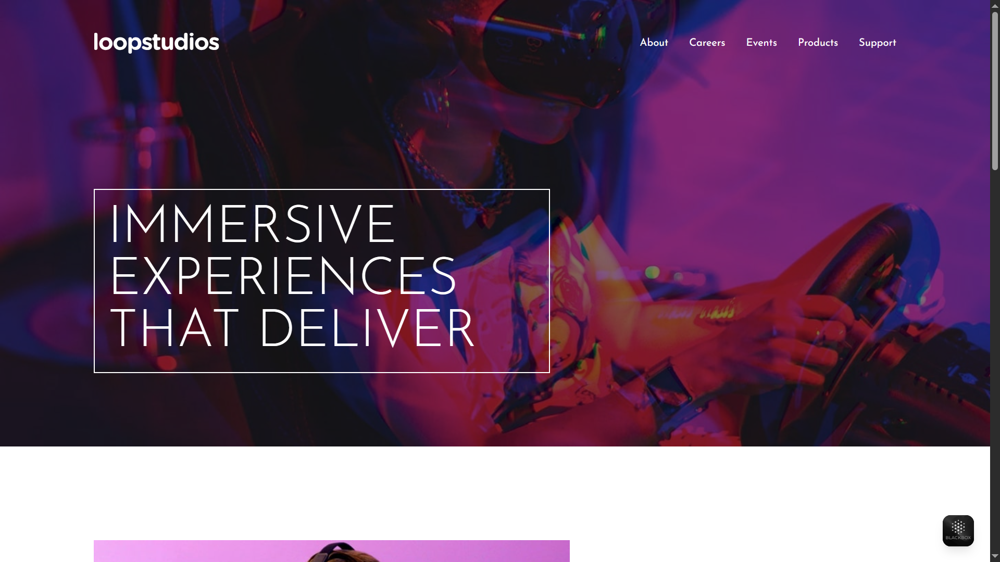

# Loopstudios Landing Page

Projeto de landing page responsiva inspirado no desafio do Frontend Mentor.

## Preview

Acesse o design completo nas imagens da pasta [`design/`](design/).

## Sobre o Projeto

Esta landing page apresenta a Loopstudios, líder em experiências imersivas de realidade virtual. O layout foi desenvolvido com foco em responsividade e boas práticas de CSS, utilizando fontes personalizadas e imagens ilustrativas.

### Funcionalidades

- Layout moderno e responsivo
- Efeitos de hover em navegação e cards
- Grid de criações interativas
- Rodapé com ícones sociais

## Estrutura

- [`index.html`](index.html): Estrutura principal da página
- [`style.css`](style.css): Estilos customizados
- [`images/`](images/): Imagens utilizadas no projeto
- [`design/`](design/): Referências de design

## Como usar

1. Clone o repositório
2. Abra o arquivo [`index.html`](index.html) em seu navegador

## Créditos

Desenvolvido por [Kauã Lima].  
Desafio baseado no [Frontend Mentor](https://www.frontendmentor.io/challenges/loopstudios-landing-page-N88J5Onjw).

---